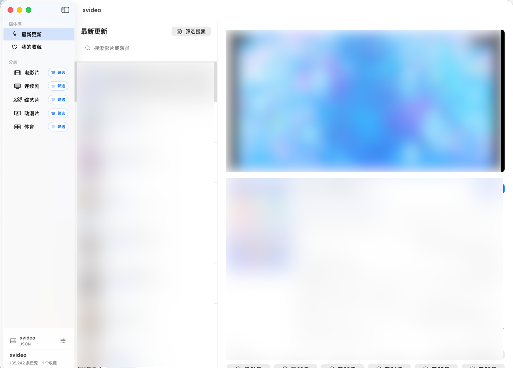

# Xvideo

[中文](README.md) | [English](README.en.md)

Xvideo is a native macOS video client built with SwiftUI. It fetches video lists, details, and playback sources from user-configured media APIs, then presents them in a desktop-style browsing and playback experience.

The project is focused on everyday watching: browsing categories, searching titles, reading details, switching episodes, saving favorites, and playing videos inside the app.

## Preview

The main window now uses a two-column cinematic layout: media library, categories, and source management on the left; the upper-right area shows the selected title details, with featured picks and the full catalog below. Clicking a title card opens quick details and refreshes the upper detail panel; double-click a card or choose Start Playback to enter the dedicated player page.



## Features

- Browse latest updates and video categories
- Use a two-column cinematic interface with an inline detail panel and a separate playback page
- Prioritize favorites in Featured Picks, and browse the full catalog in two-row shuffle batches
- Search by title, actor, or keyword
- View poster, summary, region, year, cast, director, and update status
- Ships with no built-in data source; add your own collection API before browsing
- Switch between multiple data and playback sources, including JSON, XML, and flat XML category APIs
- Jump to the previous or next episode from the player
- Rewind or fast-forward 15 seconds, and close the playback window with Esc
- Favorite videos with their source attached, then click or double-click them in My Favorites to continue watching
- Download available mp4 resources to `~/Downloads/Xvideo`

## Run

The project uses Swift Package Manager and requires macOS 14 or later.

```bash
swift run Xvideo
```

## Build The macOS App

```bash
./Scripts/build_app.sh
open .build/app/Xvideo.app
```

The build script creates:

```text
.build/app/Xvideo.app
```

## Project Structure

```text
Sources/Xvideo
├── App                  # App entry point and dependency setup
├── Presentation         # SwiftUI views and view models
├── Domain               # Models, protocols, and playback parsing
├── Data                 # API client and repository implementation
├── Infrastructure       # Downloads, favorites, and local system features
└── Shared               # Shared extensions
```

More architecture notes are available in [Docs/Architecture.md](Docs/Architecture.md).

## Notes

The app ships with no built-in data source, and all catalog data comes from user-configured APIs. Playback availability can vary depending on the resource, network environment, and source restrictions. The app validates a data source before enabling it, and keeps the current source active if validation fails. If one playback source does not play, try switching to another playback source first.
